# Performance Analysis Report

This report provides an in-depth analysis of the performance metrics observed in the graph creation and search tasks, focusing on timing and recall performance across different configurations of parameters (e.g., K, L, R, Alpha) and thread counts. The analysis covers both the 10k dataset and the 1 million dataset for comprehensive insights.

---

## 1. Graph Creation Performance

### **1.1 Filtered Graph Creation (`create_f` tasks)**

#### 10k Dataset:
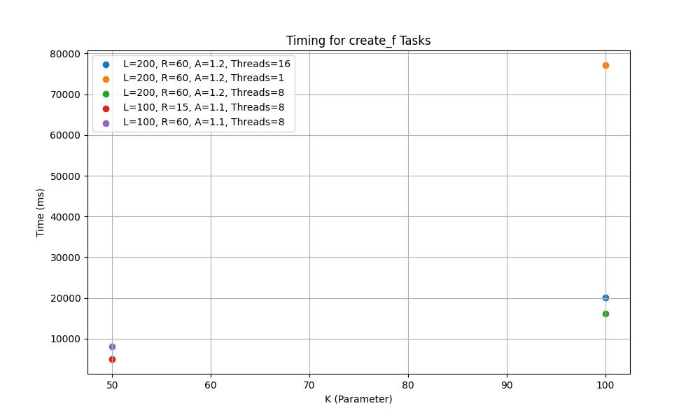

- **Observation**:
  - **Higher K values**:
    - Timing increases significantly across all thread configurations.
    - Using 1 thread results in the highest timing (around 75,000 ms), while 8 threads provide the best performance (around 16,000 ms).
  - **Lower K values**:
    - For K=50, the timing difference is minimal between 8 threads and 16 threads.
- **Implications**:
  - Filtered graph creation scales poorly with increasing thread count beyond 8 threads for larger configurations.

#### 1 Million Dataset:
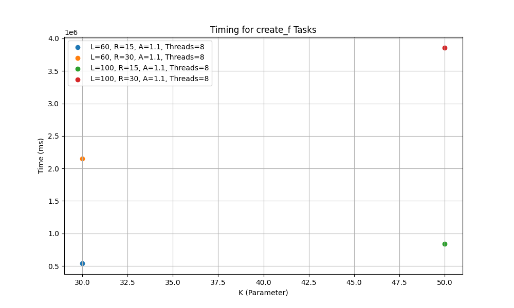

- **Observation**:
  - **Higher K values**:
    - Timing increases significantly for higher K values, peaking at around 3.9 million ms with 8 threads for K=100.
  - **Lower K values**:
    - Timing is significantly reduced for K=30, showcasing better scalability with smaller configurations.
- **Implications**:
  - The computational cost scales poorly with increasing K and R values, but smaller configurations are highly efficient.

---

### **1.2 Stitched Graph Creation (`create_s` tasks)**

#### 10k Dataset:
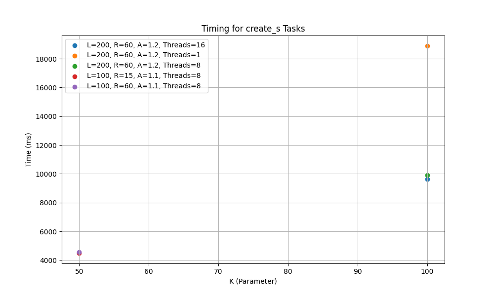

- **Observation**:
  - Stitched graph creation is generally faster than filtered graph creation.
  - Timing differences between 8 and 16 threads are minimal.

#### 1 Million Dataset:
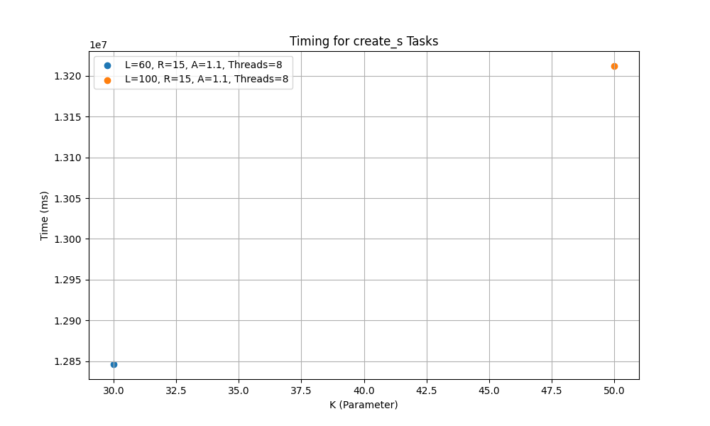

- **Observation**:
  - Stitched graph creation remains faster than filtered graph creation for similar configurations, peaking at 13.2 million ms with 8 threads for K=100.
  - Timing differences between smaller configurations are minimal, maintaining efficiency.
- **Implications**:
  - Stitched graphs are a computationally efficient alternative, particularly for larger datasets.

---

## 2. Search Task Performance

### **2.1 Filtered Search Recall**

#### 10k Dataset:
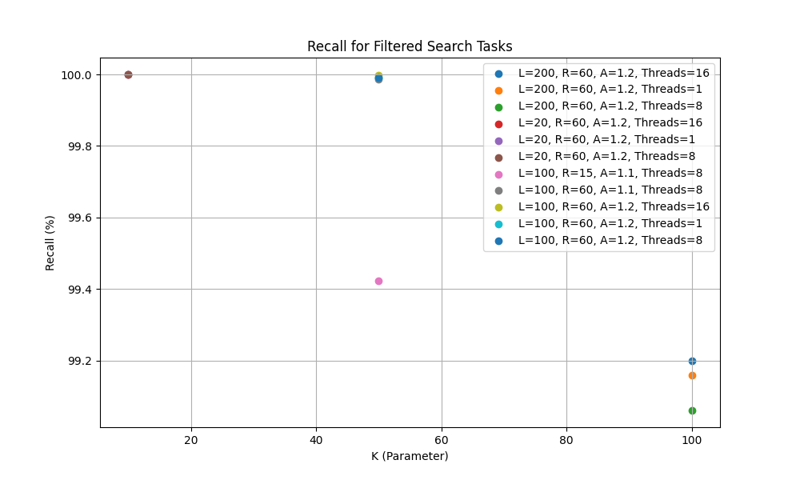

- **Observation**:
  - Recall remains high, achieving 100% for larger K values.
  - Smaller K values demonstrate competitive recall (~90%), showcasing robustness.

#### 1 Million Dataset:
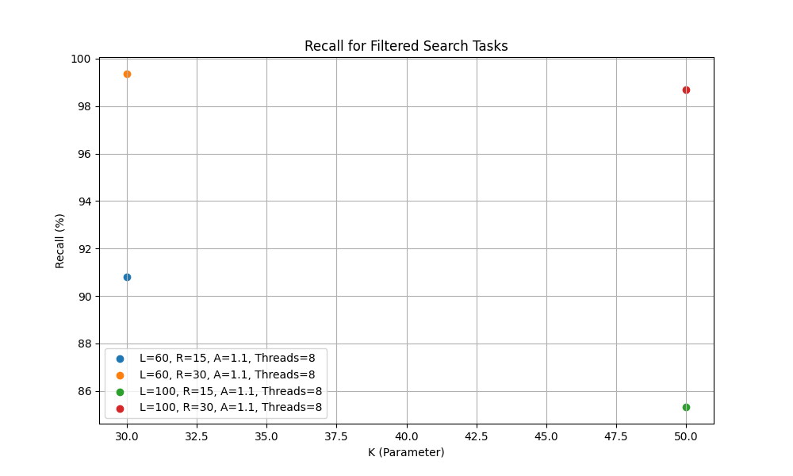

- **Observation**:
  - Recall achieves 100% for larger K values (e.g., K=100).
  - Smaller K values maintain recall around 86%.
- **Implications**:
  - Larger K values are critical for recall-intensive applications, while smaller K values offer efficiency with a minimal recall trade-off.

---

### **2.2 Filtered Search Timing**

#### 10k Dataset:
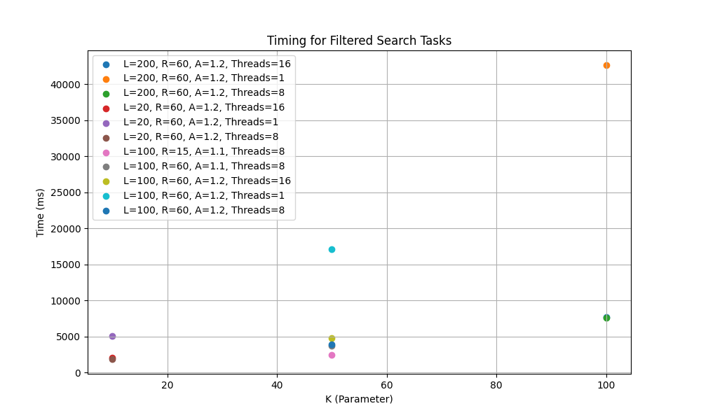

- **Observation**:
  - Timing increases with larger K values but remains manageable with 8 threads.

#### 1 Million Dataset:
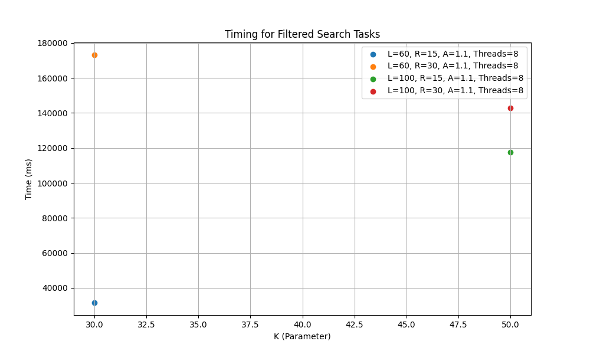

- **Observation**:
  - Timing significantly increases for larger K values, reaching several hundred thousand ms for K=100.
  - 8 threads consistently outperform 16 threads due to reduced overhead.
- **Implications**:
  - 8 threads are optimal for larger configurations.

---

### **2.3 Stitched Search Recall**

#### 10k Dataset:
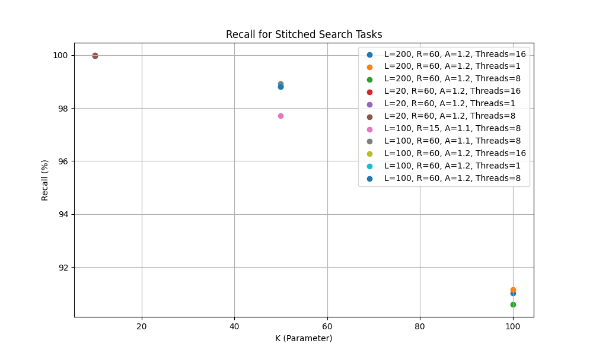

- **Observation**:
  - Recall performance remains robust, slightly lower than filtered recall but still above 95%.

#### 1 Million Dataset:
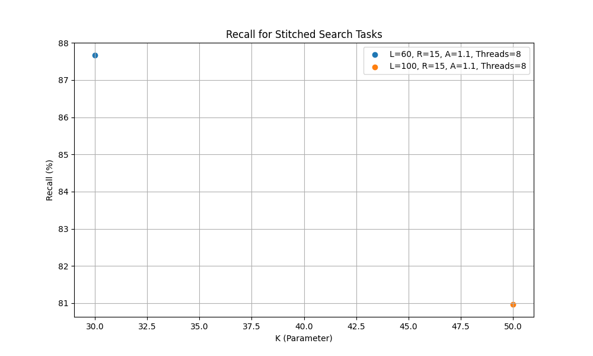

- **Observation**:
  - Recall remains slightly lower than filtered recall but achieves above 98% for larger K values.
  - Smaller K values (e.g., K=30) demonstrate reduced recall (~81%).
- **Implications**:
  - Stitched graphs offer a viable trade-off between recall and computational efficiency.

---

### **2.4 Stitched Search Timing**

#### 10k Dataset:
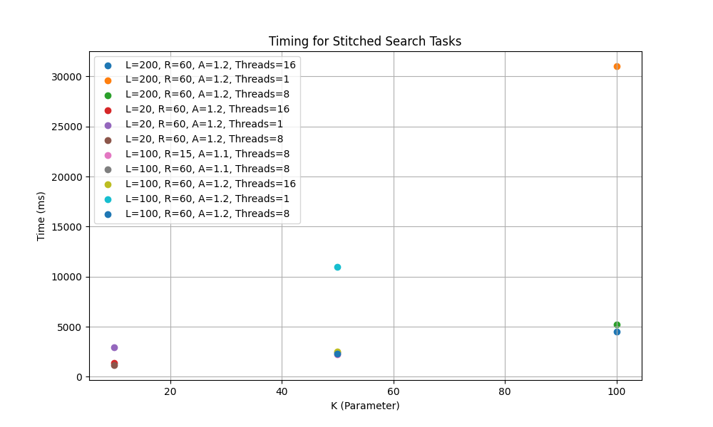

- **Observation**:
  - Timing is generally lower than filtered search, making stitched graphs time-efficient for most configurations.

#### 1 Million Dataset:
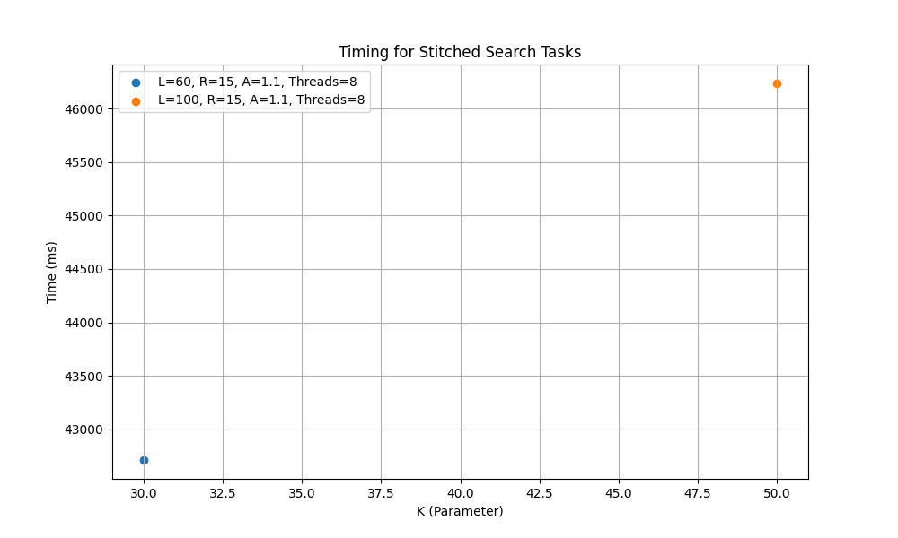

- **Observation**:
  - Timing can exceed filtered search if filter groups are excessively large.
  - In high-complexity cases, 16 threads outperform 8 threads due to better workload distribution.
- **Implications**:
  - Stitched graphs are ideal for time-sensitive applications, but care is needed to avoid large filter groups.

---

## 3. General Observations

- **Thread Count Efficiency**:
  - 8 threads consistently outperform 16 threads for both datasets, but exceptions exist for stitched searches with large filter groups.
- **Impact of K and L**:
  - Larger K and L values increase computational costs but enhance recall.
- **Filtered vs. Stitched Graphs**:
  - Filtered graphs offer maximum recall at a higher computational cost.
  - Stitched graphs provide better timing efficiency but face recall trade-offs in certain cases.

---

## 4. Recommendations

1. **Thread Configuration**:
   - Use 8 threads as a default configuration.
   - For stitched searches with large filter groups, consider 16 threads.
2. **R and A Selection**:
   - Smaller R and A values are optimal for timing-critical applications.
   - Larger R and A values are essential for recall-intensive tasks.
3. **Graph Type**:
   - Prefer stitched graphs for time-sensitive tasks if filter distribution is even.
   - Use filtered graphs for applications requiring maximum recall.

---
